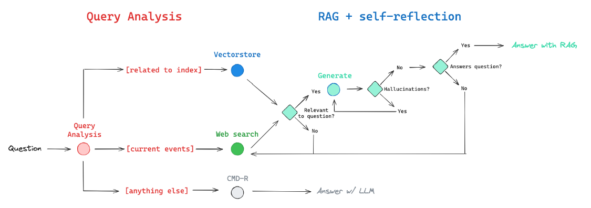

Creating Adaptive RAG

Tech-Stack Using:
Langchain
langGraph
GROQ API(Maybe)
Cohere (Command R is a scalable generative model targeting RAG and Tool Use to enable production-scale AI for enterprise.)